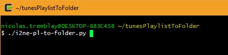
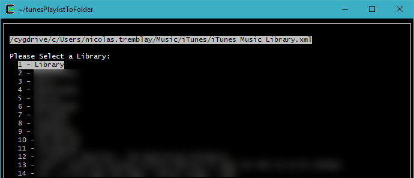
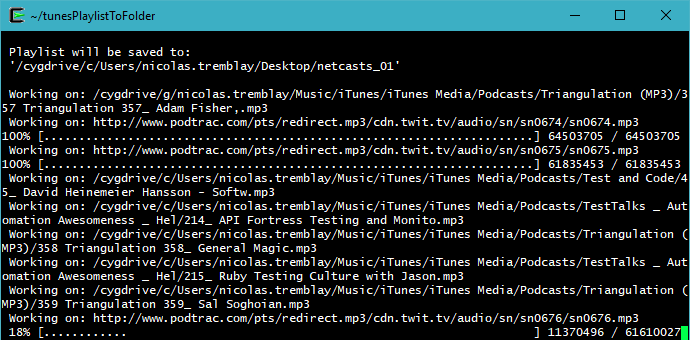

# tunesPlaylistToFolder
Python script to copy an itunes Playlist to a Folder on your Desktop. 

Files will be played in the same order as the playlist because they will be prepended with numbers.

> This is my minimum viable product, 
> Please contribute and make suggestions to improve it, 
> as long as you don't break the default worflow. :-)

### Installation

Requires [Cygwin 64bit](https://cygwin.com/setup-x86_64.exe) On windows.

Requires That you have Python3 installed in Cygwin
> Could be modified later to run on Windows Native Python3

> You also need iTunes installed on your computer as well of coarse...


Once Installed, for the initial setup, you will need to 
"pip install" the following libraries from a Cygwin Bash Shell:
```sh
$ pip3 install curses-menu
$ pip3 install wget
$ pip3 install python-slugify
```

### Usage example
To Start it



Then if the itunes library XML master plist is ay the default place, you should see:



Then your folder will be created/built on the desktop: 

> Note that URL playlist items will be downloaded, and local files copied, and files that do not exist will be skipped.



License
----

MIT


**Free Software**
